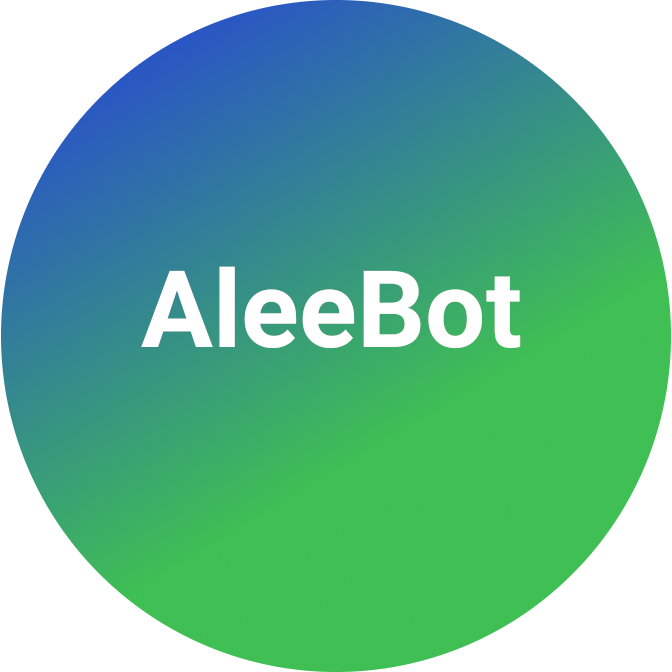

 

 

  
  

    <h4><b>AleeBot</b></h4>
    
A Discord bot made in JavaScript

     
    <a href="https://github.com/AleeCorp/AleeBot" class="btn default"><i class="fa fa-github"></i> GitHub</a>
  

  
  

    <h4><b>Silicon Linux</b></h4>
    
An Arch based distribution

     
    <a href="https://silicon-linux.net" class="btn default">Website</a> <a href="https://github.com/silicon-linux" class="btn default"><i class="fa fa-github"></i> GitHub</a>
    
  

 

  
  

    <h4><b>Project: Silicon</b></h4>
    
A hacking game by Alee and Trey

     
     <a href="https://github.com/UniverseDevGroup/Project-Silicon" class="btn default"><i class="fa fa-github"></i> GitHub</a>
  

 

